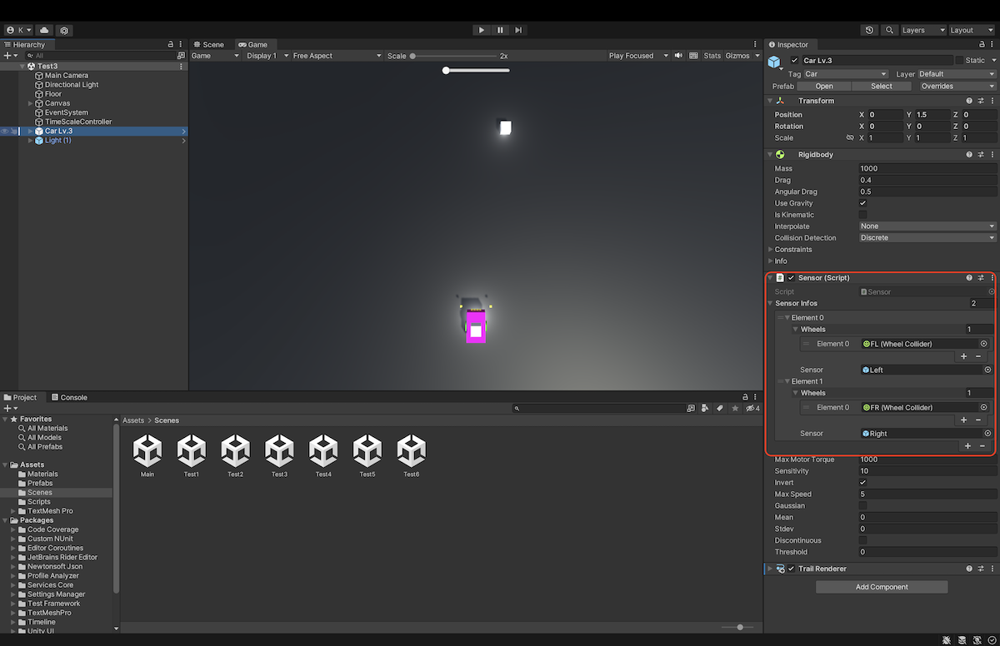

# Braitenberg ビークル

## 概要
教科書191~194ページにある演習問題8-2, 8-3に該当する。  
Braitenberg ビークルは、イタリアの神経科学者であるValentino Braitenbergによって提案された架空のロボットである。これはシンプルなセンサ、神経回路、モータによる動きを持っている。  
本プログラムのBraitenberg ビークルは以下のような特徴を持つ。  
1. 光センサ: 光を検知する。  
2. 神経回路: センサからの情報を処理し、それに応じてモータを制御する。  
3. モータ: センサから受け取った情報に基づいてビークルが動く。センサが強い光を感じるとモータが加速する。  
4. シンプルな振る舞いから複雑な振る舞いへ: ビークル自体はシンプルなセンサーと神経回路しか持たないが、ビークル同士が相互作用することによって興味深い振る舞いを示すことがある。

## 目次
****
- [Braitenberg ビークル](#braitenberg-ビークル)
  - [概要](#概要)
  - [目次](#目次)
  - [動作確認](#動作確認)
  - [Unity Editor上での動かし方](#unity-editor上での動かし方)
    - [Sceneの実行](#Sceneの実行)
  - [ビークルの構造](#ビークルの構造)
  - [ソースコードの概要](#ソースコードの概要)
    - [Sensor.cs](#Sensor.cs)
    - [Camera.cs](#Camera.cs)
    - [CarGenerator.cs](#CarGenerator.cs)
  - [各シーンの概要](#各シーンの概要)
    - [Main](#Main)
    - [Test1](#Test1)
    - [Test2](#Test2)
    - [Test3](#Test3)
    - [Test4](#Test4)
  - [実行結果](#実行結果)
    - [Main](#Main)
    - [Test1](#Test1)
    - [Test2](#Test2)
    - [Test3](#Test3)
    - [Test4](#Test4)

## 動作確認
- macOS Monterey 12.5
- windows 11
- Unity 2021.3.1f1
- Unity 2021.3.9f1
## Unity Editor上での動かし方
### Sceneの実行
ProjectタブのAssets > Scenesから選択したいシーンをダブルクリックして開く。  
  
- Main: 光源のついたビークル同士のフィールド内での相互作用を観察する。
- Test1: 静止した光源に対する、臆病者(センサとモータが同じ側に直接接続されており、光源から遠ざかる)の動きを観察する。
- Test2: 静止した光源に対する、攻撃者(センサとモータが反対側に直接接続されており、光源に近づく)の動きを観察する。
- Test3: 静止した光源に対する、求愛者(センサとモータが同じ側にインバータを通して接続されており、光源に近づく)の動きを観察する。
- Test4: 静止した光源に対する、探索者(センサとモータが反対側にインバータを通して接続されており、光源から遠ざかる)の動きを観察する。  
以上が教科書の範囲である。Test5以降は教科書の内容をもとに発展させた例である。
- Test5: 静止した光源に対する、臆病者の活性化関数(センサとトルクの関係)を正規分布に置き換えたもの。臆病者では活性化関数は線形である。
- Test6: 静止した光源に対する、臆病者の活性化関数をステップ関数に置き換えたもの。

画面上部の再生ボタンを押すとビークルが動き始める。  
  

## ビークルの構造
青い直方体のボディの両側に緑色の車輪が二つついている。前方に二つの黄色いセンサがあり、車体の上には白い立方体の光源がある。
ビークルの安定性を高めるために、摩擦の非常に少ない二つのキャスターが車体の裏側の前後についている。
 

## ソースコードの概要
### Sensor.cs
Carオブジェクトにアタッチされており、車体のセンサおよびモータを制御している。  
光を検知する代わりに、光の強度は距離の二乗に反比例することを利用し、光とセンサの距離から光強度を見積もっている。
見積もった光強度からモータのトルクを調整する。
また、トルクの最大値を定める。
以上より、光源、センサ、トルクの関係は以下の式で表される。
$T = min\lbrace	T_{max}, K_t\sum_{n=1}^{N} \frac{1}{|r_{sensor}-r_n|^2}\rbrace$  
$K_t$はトルク定数であり、Nはフィールド内に存在する全ての光源の個数である。
センサとトルクの間にインバータが接続されているときのトルクは以下の式で表される。
$T = max\lbrace	0, T_{max} - K_t\sum_{n=1}^{N} \frac{1}{|r_{sensor}-r_n|^2}\rbrace$  
### Camera.cs
MainシーンのMain Camera オブジェクトにアタッチされており、キー入力によってカメラ位置を切り替え、実行画面における視点を制御している。
### CarGenerator.cs
Mainシーンに空のオブジェクトとして存在し、フィールド内の車体を制御している。

## 各シーンの概要
### Main
Mainのシーンでは、Indexは対応する車の番号を示しており、Input Fieldに任意のIndexを指定することで、対応するビークルの視点に切り替えることができる。
また、Crashは車体が横転した回数を表している。

キー入力も受け付けており矢印ボタンを押すことで視点を切り替えることができる。
- 上矢印: フィールド全体を上から見るカメラに切り替える
- 下矢印: フィールド全体のライティングを切り替える
- 右矢印: 車体番号の一つ大きい車体に視点を切り替える
- 左矢印: 車体番号の一つ小さい車体に視点を切り替える

また、ファンクションキー(macの場合はfn+ファンクションキー)を押すことで特定のビークルの表示/非表示を切り替えられる。
- F1: 種類1(臆病者)の車体の表示/非表示を切り替える。
- F2: 種類2(攻撃者)の車体の表示/非表示を切り替える。
- F3: 種類3(求愛者)の車体の表示/非表示を切り替える。
- F4: 種類4(探索者)の車体の表示/非表示を切り替える。
- F5: 種類5の車体の表示/非表示を切り替える。
- F6: 種類6の車体の表示/非表示を切り替える。
### Test1
CarオブジェクトのInspectorのSensor Scriptにおいて、センサとモータ(Wheel Collider)が同じ側に接続されている。  
   
### Test2
CarオブジェクトのInspectorのSensor Scriptにおいて、センサとモータ(Wheel Collider)が反対側に接続されている。  
  
### Test3
CarオブジェクトのInspectorのSensor Scriptにおいて、センサとモータ(Wheel Collider)が同じ側に接続されている。  
また、invertにチェックが入っており、センサとモータがインバータを通して接続されている。  
  
### Test4
CarオブジェクトのInspectorのSensor Scriptにおいて、センサとモータ(Wheel Collider)が反対側に接続されている。 
また、invertにチェックが入っており、センサとモータがインバータを通して接続されている。 
  
## 実行結果
### Test1

### Test2

### Test3

### Test4

### Test5

### Test6

